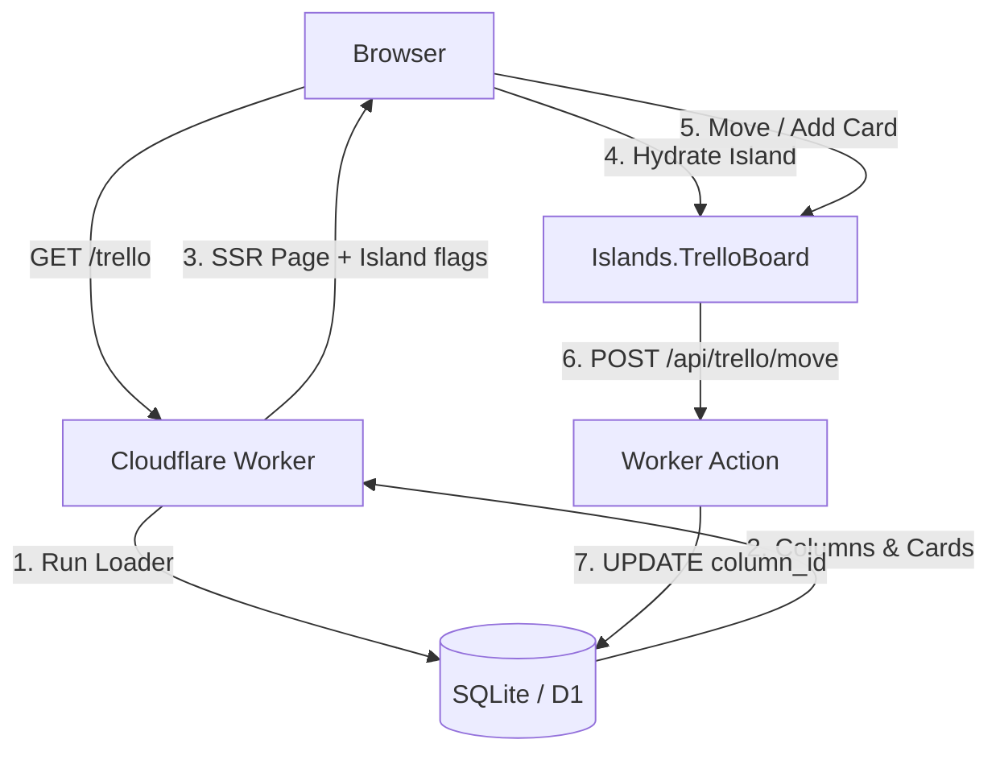

# Tutorial: Building a Trello Board in `elm-ssr`

In this tutorial we build a fully functional, database-backed, interactive **Trello Board** using `elm-ssr`.

You will learn how to:
1. **Design a relational schema** with columns and cards.
2. **Generate type-safe database modules** with the CLI scanner.
3. **Build a Loader** to Server-Side Render (SSR) the initial board state.
4. **Embed an interactive Elm Island** that handles client-side card movements.
5. **Persist state** back to the server using JSON API Actions.

---

## Architecture Overview

A Trello board needs both fast initial loading (SEO, perceived performance) and highly interactive user actions. We split the responsibilities:

* **The Page (`Routes/Trello.elm`)** — fetches columns and cards from the database on the server, renders the HTML shell, and embeds the island.
* **The Island (`Islands/TrelloBoard.elm`)** — a standard `Browser.element` that mounts client-side. It handles moving cards and adding new ones, and calls API routes to persist changes.
* **The API Routes (`Routes/Api/Trello/Card.elm`, `Routes/Api/Trello/Move.elm`)** — receive form or JSON requests from the island and run the corresponding SQL.



---

## Step 1: Define the Database Schema

Create `migrations/0002_trello.sql`:

```sql
-- migrations/0002_trello.sql

CREATE TABLE trello_columns (
    id INTEGER PRIMARY KEY AUTOINCREMENT,
    title TEXT NOT NULL,
    position INTEGER NOT NULL
);

CREATE TABLE trello_cards (
    id INTEGER PRIMARY KEY AUTOINCREMENT,
    column_id INTEGER NOT NULL,
    title TEXT NOT NULL,
    description TEXT,
    position INTEGER NOT NULL,
    FOREIGN KEY(column_id) REFERENCES trello_columns(id)
);

-- Seed data
INSERT INTO trello_columns (id, title, position) VALUES
    (1, 'To Do', 1),
    (2, 'In Progress', 2),
    (3, 'Done', 3);

INSERT INTO trello_cards (column_id, title, description, position) VALUES
    (1, 'Write Trello Tutorial', 'Step-by-step guide for elm-ssr.', 1),
    (1, 'Review PRs', 'Check the styling pipeline code.', 2),
    (2, 'Design Debugger UI', 'Build the DevTools panel.', 1);
```

Apply the migration:

```sh
bunx elm-ssr migrate up
```

---

## Step 2: Generate Type-Safe Db Modules

Scan the new tables and generate Elm modules:

```sh
bunx elm-ssr query
```

This writes two files into `src/<App>/Db/`:

- `TrelloColumns.elm` — `TrelloColumn` record, `decoder`, `all`, `byId`, `insert`, `update`, `delete`
- `TrelloCards.elm` — `TrelloCard` record, `decoder`, `all`, `byId`, `insert`, `update`, `delete`

The generated records (snake_case → camelCase):

```elm
-- TrelloColumns.elm
type alias TrelloColumn =
    { id : Int
    , title : String
    , position : Int
    }

-- TrelloCards.elm
type alias TrelloCard =
    { id : Int
    , columnId : Int
    , title : String
    , description : Maybe String
    , position : Int
    }
```

---

## Step 3: Scaffold Routes

```sh
# SSR page
bunx elm-ssr route trello

# JSON API routes
bunx elm-ssr route api/trello/card --api
bunx elm-ssr route api/trello/move --api
```

Also create the island file manually: `src/<App>/Islands/TrelloBoard.elm`.

---

## Step 4: Implement the Server-Side Page

`src/<App>/Routes/Trello.elm` fetches both tables with `Loader.map2` and hands the data to the island as flags.

```elm
module Example.Basic.Routes.Trello exposing (page, action)

import ElmSsr.Action as Action exposing (Action)
import ElmSsr.Document exposing (Document)
import ElmSsr.Html exposing (div)
import ElmSsr.Html.Attributes exposing (class)
import ElmSsr.Loader as Loader exposing (Loader)
import ElmSsr.Page as Page
import ElmSsr.Route exposing (Request)
import Example.Basic.Db.TrelloColumns as TrelloColumns
import Example.Basic.Db.TrelloCards as TrelloCards
import Example.Basic.Islands.TrelloBoard as TrelloBoard
import Example.Basic.View.Shared as Shared


type alias BoardData =
    { columns : List TrelloColumns.TrelloColumn
    , cards : List TrelloCards.TrelloCard
    }


page : Request -> Loader (Document Never)
page _ =
    Loader.map2 BoardData
        TrelloColumns.all
        TrelloCards.all
        |> Loader.map view


action : Request -> Action (Document Never)
action _ =
    Action.fail 405 "Method not allowed"


view : BoardData -> Document Never
view data =
    Page.page
        { title = "Trello Board | elm-ssr"
        , head = Shared.head
        , body =
            [ Shared.shell "Kanban Board"
                [ div [ class "board-container" ]
                    [ TrelloBoard.embed
                        { columns = data.columns
                        , cards = data.cards
                        }
                    ]
                ]
            ]
        }
```

---

## Step 5: Implement the Island

`src/<App>/Islands/TrelloBoard.elm` — a normal `Browser.element` using stock `elm/html` and `elm/http`.

> **How data flows to the island.** The server SSR-renders an `<elm-ssr-island>` marker with the encoded flags. The browser runtime decodes them and feeds them to `init`. No ports required.

> **Sending requests to API routes.** The island posts JSON with **string values** (e.g. `Encode.string (String.fromInt cardId)`). The runtime parses JSON bodies and exposes each field through `Route.formValue` on the Elm server side — and `Route.formValue` decodes values as strings, so ints must be stringified before sending.

```elm
module Example.Basic.Islands.TrelloBoard exposing
    ( embed
    , Flags, Model, Msg
    , encodeFlags
    , init, main, subscriptions, update, view
    )

import Browser
import ElmSsr.Html as SsrHtml exposing (Node)
import ElmSsr.Html.Attributes as SsrAttr
import ElmSsr.Island as Island
import Html exposing (Html, button, div, h3, input, p, text)
import Html.Attributes exposing (class, placeholder, type_, value)
import Html.Events exposing (onClick, onInput)
import Http
import Json.Decode as Decode
import Json.Encode as Encode


-- 1. SSR embed helper (called from the page)

embed : Flags -> Node msg
embed =
    Island.embed "TrelloBoard"
        { encodeFlags = encodeFlags
        , fallback = fallback
        , id = Just "main-trello-board"
        }


-- 2. Types

type alias Column =
    { id : Int
    , title : String
    , position : Int
    }


type alias Card =
    { id : Int
    , columnId : Int
    , title : String
    , description : Maybe String
    , position : Int
    }


type alias Flags =
    { columns : List Column
    , cards : List Card
    }


type alias Model =
    { columns : List Column
    , cards : List Card
    , newCardTitles : List ( Int, String )
    , error : Maybe String
    }


type Msg
    = MoveCard Int Int
    | InputCardTitle Int String
    | AddCard Int
    | SaveCardResponse (Result Http.Error Card)
    | MoveCardResponse (Result Http.Error ())


-- 3. Encoders (for flags serialised into the SSR marker)

encodeFlags : Flags -> Encode.Value
encodeFlags flags =
    Encode.object
        [ ( "columns", Encode.list encodeColumn flags.columns )
        , ( "cards", Encode.list encodeCard flags.cards )
        ]


encodeColumn : Column -> Encode.Value
encodeColumn col =
    Encode.object
        [ ( "id", Encode.int col.id )
        , ( "title", Encode.string col.title )
        , ( "position", Encode.int col.position )
        ]


encodeCard : Card -> Encode.Value
encodeCard card =
    Encode.object
        [ ( "id", Encode.int card.id )
        , ( "columnId", Encode.int card.columnId )
        , ( "title", Encode.string card.title )
        , ( "description"
          , case card.description of
                Just desc ->
                    Encode.string desc

                Nothing ->
                    Encode.null
          )
        , ( "position", Encode.int card.position )
        ]


-- 4. SSR fallback (shown before the island mounts)

fallback : Flags -> List (Node msg)
fallback _ =
    [ SsrHtml.div [ SsrAttr.class "board-fallback" ]
        [ SsrHtml.p [] [ SsrHtml.text "Loading interactive board…" ] ]
    ]


-- 5. Standard Browser.element

main : Program Flags Model Msg
main =
    Browser.element
        { init = init
        , update = update
        , view = view
        , subscriptions = subscriptions
        }


init : Flags -> ( Model, Cmd Msg )
init flags =
    ( { columns = List.sortBy .position flags.columns
      , cards = List.sortBy .position flags.cards
      , newCardTitles = []
      , error = Nothing
      }
    , Cmd.none
    )


subscriptions : Model -> Sub Msg
subscriptions _ =
    Sub.none


-- 6. Update

update : Msg -> Model -> ( Model, Cmd Msg )
update msg model =
    case msg of
        InputCardTitle colId val ->
            let
                cleaned =
                    List.filter (\( cid, _ ) -> cid /= colId) model.newCardTitles
            in
            ( { model | newCardTitles = ( colId, val ) :: cleaned }, Cmd.none )

        MoveCard cardId newColId ->
            -- Optimistic update: move the card locally immediately.
            let
                updatedCards =
                    List.map
                        (\c ->
                            if c.id == cardId then
                                { c | columnId = newColId }

                            else
                                c
                        )
                        model.cards
            in
            ( { model | cards = updatedCards }
            , Http.post
                { url = "/api/trello/move"
                  -- Send integer IDs as strings so Route.formValue can read them.
                , body =
                    Http.jsonBody <|
                        Encode.object
                            [ ( "cardId", Encode.string (String.fromInt cardId) )
                            , ( "columnId", Encode.string (String.fromInt newColId) )
                            ]
                , expect = Http.expectWhatever MoveCardResponse
                }
            )

        AddCard colId ->
            let
                titleVal =
                    model.newCardTitles
                        |> List.filter (\( cid, _ ) -> cid == colId)
                        |> List.head
                        |> Maybe.map Tuple.second
                        |> Maybe.withDefault ""
                        |> String.trim
            in
            if String.isEmpty titleVal then
                ( model, Cmd.none )

            else
                ( model
                , Http.post
                    { url = "/api/trello/card"
                    , body =
                        Http.jsonBody <|
                            Encode.object
                                [ ( "columnId", Encode.string (String.fromInt colId) )
                                , ( "title", Encode.string titleVal )
                                ]
                    , expect = Http.expectJson SaveCardResponse cardDecoder
                    }
                )

        SaveCardResponse result ->
            case result of
                Ok newCard ->
                    let
                        cleanedInputs =
                            List.filter (\( cid, _ ) -> cid /= newCard.columnId) model.newCardTitles
                    in
                    ( { model | cards = model.cards ++ [ newCard ], newCardTitles = cleanedInputs }
                    , Cmd.none
                    )

                Err _ ->
                    ( { model | error = Just "Failed to save card." }, Cmd.none )

        MoveCardResponse result ->
            case result of
                Ok () ->
                    ( model, Cmd.none )

                Err _ ->
                    ( { model | error = Just "Failed to persist card movement." }, Cmd.none )


-- Card decoder (matches the JSON the server returns)

cardDecoder : Decode.Decoder Card
cardDecoder =
    Decode.map5 Card
        (Decode.field "id" Decode.int)
        (Decode.field "columnId" Decode.int)
        (Decode.field "title" Decode.string)
        (Decode.field "description" (Decode.nullable Decode.string))
        (Decode.field "position" Decode.int)


-- 7. View

view : Model -> Html Msg
view model =
    div [ class "trello-board" ]
        [ case model.error of
            Just err ->
                div [ class "error-banner" ] [ text err ]

            Nothing ->
                text ""
        , div [ class "columns-wrapper" ]
            (List.map (viewColumn model.cards model.newCardTitles) model.columns)
        ]


viewColumn : List Card -> List ( Int, String ) -> Column -> Html Msg
viewColumn allCards inputMap col =
    let
        columnCards =
            List.filter (\c -> c.columnId == col.id) allCards

        currentInput =
            inputMap
                |> List.filter (\( cid, _ ) -> cid == col.id)
                |> List.head
                |> Maybe.map Tuple.second
                |> Maybe.withDefault ""
    in
    div [ class "board-column" ]
        [ h3 [ class "column-title" ] [ text col.title ]
        , div [ class "cards-list" ] (List.map (viewCard col.id) columnCards)
        , div [ class "card-creator" ]
            [ input
                [ type_ "text"
                , placeholder "New card title…"
                , value currentInput
                , onInput (InputCardTitle col.id)
                ]
                []
            , button [ onClick (AddCard col.id) ] [ text "Add" ]
            ]
        ]


viewCard : Int -> Card -> Html Msg
viewCard currentColId card =
    div [ class "board-card" ]
        [ p [ class "card-title" ] [ text card.title ]
        , div [ class "card-actions" ]
            [ if currentColId > 1 then
                button [ onClick (MoveCard card.id (currentColId - 1)) ] [ text "←" ]

              else
                text ""
            , if currentColId < 3 then
                button [ onClick (MoveCard card.id (currentColId + 1)) ] [ text "→" ]

              else
                text ""
            ]
        ]
```

---

## Step 6: Implement the API Actions

### Card creation — `Routes/Api/Trello/Card.elm`

Reads `columnId` and `title` from the request body, inserts a new card, then returns the created card as JSON so the island can add it to its local model without refetching.

`Route.formValue` reads both `application/x-www-form-urlencoded` form fields **and** keys from a flat JSON body — which is why the island sends integer IDs as JSON strings.

```elm
module Example.Basic.Routes.Api.Trello.Card exposing (page, action)

import ElmSsr.Action as Action exposing (Action)
import ElmSsr.Document exposing (Document)
import ElmSsr.Loader as Loader exposing (Loader)
import ElmSsr.Route as Route exposing (Request)
import Example.Basic.Db.TrelloCards as TrelloCards
import Json.Decode as Decode
import Json.Encode as Encode


page : Request -> Loader (Document Never)
page _ =
    Loader.fail 405 "GET not allowed"


action : Request -> Action (Document Never)
action request =
    case ( Route.formValue "columnId" request, Route.formValue "title" request ) of
        ( Just colIdStr, Just title ) ->
            case String.toInt colIdStr of
                Just colId ->
                    Action.fromLoader
                        (TrelloCards.insert
                            { columnId = colId
                            , title = title
                            , description = Nothing
                            , position = 100
                            }
                        )
                        |> Action.andThen (\_ -> Action.fromLoader (fetchNewCard colId))
                        |> Action.andThen (\card -> Action.json (encodeCard card))

                Nothing ->
                    Action.fail 400 "columnId must be an integer"

        _ ->
            Action.fail 400 "Missing columnId or title"


-- Fetch the most recently inserted card by returning the highest id.
-- This is safe for single-writer SQLite; for concurrent writers use
-- RETURNING on PostgreSQL via Loader.softQueryOne.
fetchNewCard : Int -> Loader TrelloCards.TrelloCard
fetchNewCard colId =
    Loader.queryOne
        { sql = "SELECT id, column_id, title, description, position FROM trello_cards WHERE column_id = ? ORDER BY id DESC LIMIT 1"
        , params = [ Encode.int colId ]
        , decoder = TrelloCards.decoder
        }
        |> Loader.andThen
            (\maybeCard ->
                case maybeCard of
                    Just card ->
                        Loader.succeed card

                    Nothing ->
                        Loader.fail 500 "Failed to retrieve inserted card"
            )


encodeCard : TrelloCards.TrelloCard -> Encode.Value
encodeCard card =
    Encode.object
        [ ( "id", Encode.int card.id )
        , ( "columnId", Encode.int card.columnId )
        , ( "title", Encode.string card.title )
        , ( "description"
          , case card.description of
                Just desc ->
                    Encode.string desc

                Nothing ->
                    Encode.null
          )
        , ( "position", Encode.int card.position )
        ]
```

### Card movement — `Routes/Api/Trello/Move.elm`

Only updates `column_id`. We use a targeted `Loader.execute` with raw SQL rather than the generated `TrelloCards.update`, which would overwrite every field including title and position.

```elm
module Example.Basic.Routes.Api.Trello.Move exposing (page, action)

import ElmSsr.Action as Action exposing (Action)
import ElmSsr.Document exposing (Document)
import ElmSsr.Loader as Loader exposing (Loader)
import ElmSsr.Route as Route exposing (Request)
import Json.Encode as Encode


page : Request -> Loader (Document Never)
page _ =
    Loader.fail 405 "GET not allowed"


action : Request -> Action (Document Never)
action request =
    case ( Route.formValue "cardId" request, Route.formValue "columnId" request ) of
        ( Just cardIdStr, Just colIdStr ) ->
            case ( String.toInt cardIdStr, String.toInt colIdStr ) of
                ( Just cardId, Just colId ) ->
                    Action.fromLoader
                        (Loader.execute
                            { sql = "UPDATE trello_cards SET column_id = ? WHERE id = ?"
                            , params = [ Encode.int colId, Encode.int cardId ]
                            }
                        )
                        |> Action.andThen (\_ -> Action.json (Encode.object [ ( "ok", Encode.bool True ) ]))

                _ ->
                    Action.fail 400 "cardId and columnId must be integers"

        _ ->
            Action.fail 400 "Missing cardId or columnId"
```

---

## Step 7: Add Styles

`src/app.css` (or `styles.ts`):

```css
.board-container {
  padding: 2rem 0;
}

.columns-wrapper {
  display: grid;
  grid-template-columns: repeat(3, 1fr);
  gap: 1.5rem;
}

.board-column {
  background: rgba(255, 255, 255, 0.45);
  backdrop-filter: blur(8px);
  border-radius: 8px;
  border: 1px solid rgba(0, 0, 0, 0.08);
  padding: 1rem;
}

.column-title {
  margin-top: 0;
  font-size: 1.25rem;
  border-bottom: 2px solid rgba(0, 0, 0, 0.05);
  padding-bottom: 0.5rem;
}

.board-card {
  background: white;
  border-radius: 6px;
  box-shadow: 0 2px 4px rgba(0, 0, 0, 0.05);
  padding: 0.75rem;
  margin-bottom: 0.75rem;
}

.card-title {
  margin: 0 0 0.5rem 0;
}

.card-actions button {
  padding: 0.25rem 0.5rem;
  margin-right: 0.25rem;
  cursor: pointer;
}

.card-creator {
  display: flex;
  gap: 0.5rem;
  margin-top: 0.75rem;
}

.card-creator input {
  flex-grow: 1;
  padding: 0.5rem;
  border-radius: 4px;
  border: 1px solid rgba(0, 0, 0, 0.15);
}

.error-banner {
  background: #fee;
  border: 1px solid #fcc;
  border-radius: 4px;
  padding: 0.5rem 1rem;
  margin-bottom: 1rem;
  color: #c00;
}
```

---

## Step 8: Build and Run

```sh
bun run check   # verify Elm + TypeScript compile
bun run dev     # start the dev server
```

Navigate to `http://localhost:8787/trello`. You will see the board SSR-rendered straight from the database. Use the ← → buttons to move cards between columns and the "Add" form to create new ones; every change persists to SQLite/D1.

---

## What's not in this tutorial

- **Drag-and-drop**: wire a JS drag event through a port and emit `MoveCard` from the port sub.
- **Optimistic rollback**: `MoveCardResponse (Err _)` currently just shows a banner. Store the old `columnId` before the optimistic update and revert it on error.
- **Server-push board updates**: see [SSE](../sse.md) for broadcasting card moves to other open tabs via `EventSource`.
- **CSRF protection**: enable `csrf: true` in `createWorkerApp` and embed `Loader.csrfToken` in the page flags, passing it as a custom header on every island `Http.post`. See [Sessions](../sessions.md).
