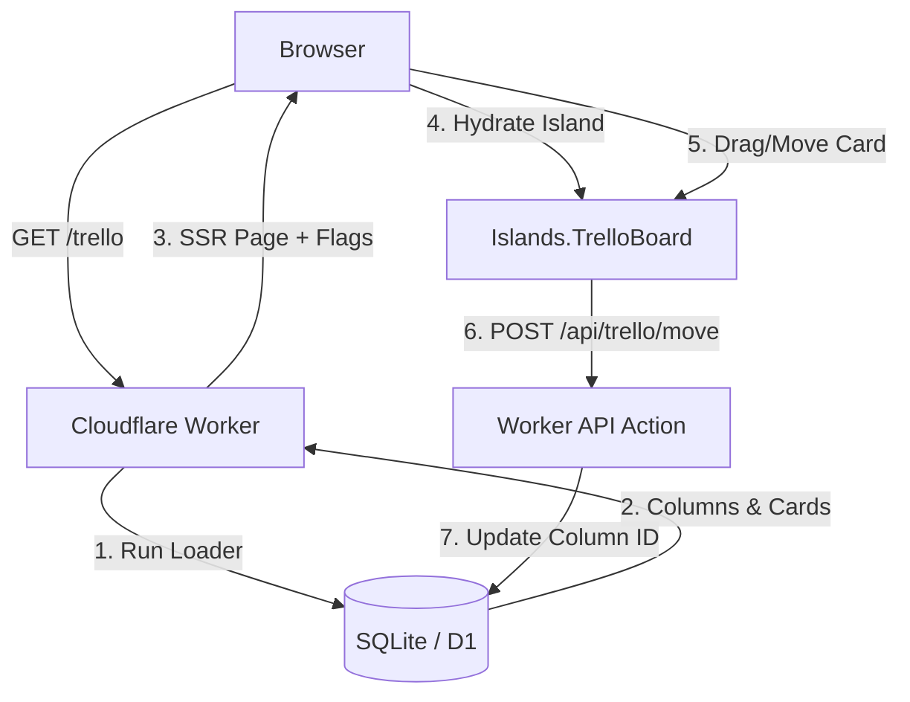

# Tutorial: Building a Trello Board in `elm-ssr`

In this tutorial, we will build a fully functional, database-backed, interactive **Trello Board** using `elm-ssr`. 

You will learn how to:
1. **Design a relational schema** with columns and cards.
2. **Generate type-safe database queries** using the CLI scanner.
3. **Build a Loader** to Server-Side Render (SSR) the initial state.
4. **Embed an interactive Elm Island** to handle client-side drag-and-drop or movements.
5. **Persist state dynamically** back to the server using Actions.

---

## Architecture Overview

A Trello board requires both high-performance initial loading (for SEO and perceived speed) and highly interactive user actions. We will split the responsibilities:

* **The Page (`Routes/Trello.elm`)**: Fetches columns and cards from the database on the server, renders the main HTML shell, and embeds the interactive island.
* **The Island (`Islands/TrelloBoard.elm`)**: A standard `Browser.element` that mounts on the client. It handles visual interactions (moving cards, opening forms) and issues `fetch` requests to update the database.
* **The API Routes (`Routes/Api/Trello/Move.elm`, etc.)**: Endpoints that accept card updates and run database writes.



---

## Step 1: Define the Database Schema

First, let's define our database structure. We need columns (e.g. "To Do", "In Progress") and cards belonging to those columns.

Create a new migration file `migrations/0002_trello.sql`:

```sql
-- migrations/0002_trello.sql

CREATE TABLE trello_columns (
    id INTEGER PRIMARY KEY AUTOINCREMENT,
    title TEXT NOT NULL,
    position INTEGER NOT NULL
);

CREATE TABLE trello_cards (
    id INTEGER PRIMARY KEY AUTOINCREMENT,
    column_id INTEGER NOT NULL,
    title TEXT NOT NULL,
    description TEXT,
    position INTEGER NOT NULL,
    FOREIGN KEY(column_id) REFERENCES trello_columns(id)
);

-- Seed initial data
INSERT INTO trello_columns (id, title, position) VALUES 
(1, 'To Do', 1),
(2, 'In Progress', 2),
(3, 'Done', 3);

INSERT INTO trello_cards (column_id, title, description, position) VALUES 
(1, 'Write Trello Tutorial', 'Write a step-by-step guide for elm-ssr.', 1),
(1, 'Review PRs', 'Check the styling pipeline code.', 2),
(2, 'Design Debugger UI', 'Build the DevTools panel.', 1);
```

Run your migrations to apply these changes locally:
```sh
bunx elm-ssr migrate up
```

---

## Step 2: Generate Type-Safe Db Modules

Next, let `elm-ssr` inspect your new schema and generate the type-safe Elm representations. Run:
```sh
bunx elm-ssr query
```

This generates two Elm files in your app's Db folder:
1. `src/<App>/Db/TrelloColumns.elm` (exposing `TrelloColumn` records, decoders, and CRUD utilities)
2. `src/<App>/Db/TrelloCards.elm` (exposing `TrelloCard` records, decoders, and CRUD utilities)

Let's check the generated records:
```elm
-- Generated in TrelloColumns.elm:
type alias TrelloColumn =
    { id : Int
    , title : String
    , position : Int
    }

-- Generated in TrelloCards.elm:
type alias TrelloCard =
    { id : Int
    , columnId : Int
    , title : String
    , description : Maybe String
    , position : Int
    }
```

---

## Step 3: Scaffold Routes & The Island

Let's scaffold our route page and the interactive board island.

```sh
# Scaffold the page route
bunx elm-ssr route trello

# Scaffold the API route to save cards
bunx elm-ssr route api/trello/card --api

# Scaffold the API route to handle card movements
bunx elm-ssr route api/trello/move --api
```

Now, create the island file: `src/<App>/Islands/TrelloBoard.elm`. We will implement it in Step 5.

---

## Step 4: Implement the Server-Side Page & Loader

On the server, we want to fetch all columns and cards in a single page load. We will use the Query DSL to retrieve both lists and combine them.

Open `src/<App>/Routes/Trello.elm` and write the Loader:

```elm
module Example.Basic.Routes.Trello exposing (page, action)

import ElmSsr.Action as Action exposing (Action)
import ElmSsr.Document exposing (Document)
import ElmSsr.Html exposing (div, text)
import ElmSsr.Html.Attributes exposing (class)
import ElmSsr.Loader as Loader exposing (Loader)
import ElmSsr.Page as Page
import ElmSsr.Route exposing (Request)
import Example.Basic.Db.TrelloColumns as TrelloColumns
import Example.Basic.Db.TrelloCards as TrelloCards
import Example.Basic.Islands.TrelloBoard as TrelloBoard
import Example.Basic.View.Shared as Shared

-- Define a helper record to pass both collections to our flags
type alias BoardData =
    { columns : List TrelloColumns.TrelloColumn
    , cards : List TrelloCards.TrelloCard
    }

page : Request -> Loader (Document Never)
page _ =
    Loader.map2 BoardData
        TrelloColumns.all
        TrelloCards.all
        |> Loader.map view

action : Request -> Action (Document Never)
action _ =
    Action.fail 405 "Method not allowed"

view : BoardData -> Document Never
view data =
    Page.page
        { title = "Trello Board | elm-ssr"
        , head = Shared.head
        , body =
            [ Shared.shell "Kanban Board"
                [ div [ class "board-container" ]
                    [ -- Embed the interactive board island and pass DB records as flags
                      TrelloBoard.embed
                        { columns = data.columns
                        , cards = data.cards
                        }
                    ]
                ]
            ]
        }
```

---

## Step 5: Implement the Client-Side Interactive Island

Now we will build the client-side interactive board. The board needs to maintain a local copy of columns and cards, draw columns side-by-side, allow adding cards locally, and support moving cards.

Open `src/<App>/Islands/TrelloBoard.elm`:

```elm
module Example.Basic.Islands.TrelloBoard exposing
    ( embed
    , Flags, Model, Msg
    , encodeFlags
    , init, main, subscriptions, update, view
    )

import Browser
import ElmSsr.Html as SsrHtml exposing (Node)
import ElmSsr.Html.Attributes as SsrAttr
import ElmSsr.Island as Island
import Html exposing (Html, button, div, h3, input, p, text, textarea)
import Html.Attributes exposing (class, placeholder, style, type_, value)
import Html.Events import onClick, onInput
import Http
import Json.Decode as Decode
import Json.Encode as Encode

-- 1. Embedding properties
embed : Flags -> Node msg
embed =
    Island.embed "TrelloBoard"
        { encodeFlags = encodeFlags
        , fallback = fallback
        , id = Just "main-trello-board" -- Keep active across SPA page swaps
        }

-- 2. Schema types matching generated database descriptors
type alias Column =
    { id : Int
    , title : String
    , position : Int
    }

type alias Card =
    { id : Int
    , columnId : Int
    , title : String
    , description : Maybe String
    , position : Int
    }

type alias Flags =
    { columns : List Column
    , cards : List Card
    }

type alias Model =
    { columns : List Column
    , cards : List Card
    -- Local form UI state
    , newCardTitles : List ( Int, String ) -- Map of columnId -> input value
    , error : Maybe String
    }

type Msg
    = MoveCard Int Int -- cardId, newColumnId
    | InputCardTitle Int String -- columnId, value
    | AddCard Int -- columnId
    | SaveCardResponse (Result Http.Error Card)
    | MoveCardResponse (Result Http.Error ())

-- 3. Hydration & Encoders
encodeFlags : Flags -> Encode.Value
encodeFlags flags =
    Encode.object
        [ ( "columns", Encode.list encodeColumn flags.columns )
        , ( "cards", Encode.list encodeCard flags.cards )
        ]

encodeColumn : Column -> Encode.Value
encodeColumn col =
    Encode.object
        [ ( "id", Encode.int col.id )
        , ( "title", Encode.string col.title )
        , ( "position", Encode.int col.position )
        ]

encodeCard : Card -> Encode.Value
encodeCard card =
    Encode.object
        [ ( "id", Encode.int card.id )
        , ( "columnId", Encode.int card.columnId )
        , ( "title", Encode.string card.title )
        , ( "description", Maybe.withDefault Encode.null (Maybe.map Encode.string card.description) )
        , ( "position", Encode.int card.position )
        ]

-- 4. Server-Side Fallback Markup
fallback : Flags -> List (Node msg)
fallback flags =
    [ SsrHtml.div [ SsrAttr.class "board-fallback" ]
        [ SsrHtml.p [] [ SsrHtml.text "Loading interactive board..." ] ]
    ]

-- 5. Standard Browser Program
main : Program Flags Model Msg
main =
    Browser.element
        { init = init
        , update = update
        , view = view
        , subscriptions = subscriptions
        }

init : Flags -> ( Model, Cmd Msg )
init flags =
    ( { columns = List.sortBy .position flags.columns
      , cards = List.sortBy .position flags.cards
      , newCardTitles = []
      , error = Nothing
      }
    , Cmd.none
    )

subscriptions : Model -> Sub Msg
subscriptions _ =
    Sub.none

-- 6. Interactive State & API Persistence Actions
update : Msg -> Model -> ( Model, Cmd Msg )
update msg model =
    case msg of
        InputCardTitle colId val ->
            let
                cleaned =
                    List.filter (\( cid, _ ) -> cid /= colId) model.newCardTitles
            in
            ( { model | newCardTitles = ( colId, val ) :: cleaned }, Cmd.none )

        MoveCard cardId newColId ->
            -- Optimistic UI Update: immediately update locally so it feels instant
            let
                updatedCards =
                    List.map
                        (\c ->
                            if c.id == cardId then
                                { c | columnId = newColId }

                            else
                                c
                        )
                        model.cards
            in
            ( { model | cards = updatedCards }
              -- Persist to database via API POST
            , Http.post
                { url = "/api/trello/move"
                , body =
                    Http.jsonBody <|
                        Encode.object
                            [ ( "cardId", Encode.int cardId )
                            , ( "columnId", Encode.int newColId )
                            ]
                , expect = Http.expectWhatever MoveCardResponse
                }
            )

        AddCard colId ->
            let
                titleVal =
                    List.filter (\( cid, _ ) -> cid == colId) model.newCardTitles
                        |> List.map Tuple.second
                        |> List.head
                        |> Maybe.withDefault ""
                        |> String.trim
            in
            if String.isEmpty titleVal then
                ( model, Cmd.none )

            else
                ( model
                  -- Persist card to DB
                , Http.post
                    { url = "/api/trello/card"
                    , body =
                        Http.jsonBody <|
                            Encode.object
                                [ ( "columnId", Encode.int colId )
                                , ( "title", Encode.string titleVal )
                                ]
                    , expect = Http.expectJson SaveCardResponse cardDecoder
                    }
                )

        SaveCardResponse result ->
            case result of
                Ok newCard ->
                    -- Add new card to local list, and clear input
                    let
                        updatedCards =
                            model.cards ++ [ newCard ]

                        cleanedInputs =
                            List.filter (\( cid, _ ) -> cid /= newCard.columnId) model.newCardTitles
                    in
                    ( { model | cards = updatedCards, newCardTitles = cleanedInputs }, Cmd.none )

                Err _ ->
                    ( { model | error = Just "Failed to save card." }, Cmd.none )

        MoveCardResponse result ->
            case result of
                Ok () ->
                    ( model, Cmd.none )

                Err _ ->
                    ( { model | error = Just "Failed to persist movement." }, Cmd.none )

-- Card JSON Decoder
cardDecoder : Decode.Decoder Card
cardDecoder =
    Decode.map5 Card
        (Decode.field "id" Decode.int)
        (Decode.field "columnId" Decode.int)
        (Decode.field "title" Decode.string)
        (Decode.field "description" (Decode.nullable Decode.string))
        (Decode.field "position" Decode.int)

-- 7. Presentation View
view : Model -> Html Msg
view model =
    div [ class "trello-board" ]
        [ case model.error of
            Just err ->
                div [ class "error-banner" ] [ text err ]

            Nothing ->
                text ""
        , div [ class "columns-wrapper" ]
            (List.map (viewColumn model.cards model.newCardTitles) model.columns)
        ]

viewColumn : List Card -> List ( Int, String ) -> Column -> Html Msg
viewColumn allCards inputMap col =
    let
        columnCards =
            List.filter (\c -> c.columnId == col.id) allCards

        currentInput =
            List.filter (\( cid, _ ) -> cid == col.id) inputMap
                |> List.map Tuple.second
                |> List.head
                |> Maybe.withDefault ""
    in
    div [ class "board-column" ]
        [ h3 [ class "column-title" ] [ text col.title ]
        , div [ class "cards-list" ]
            (List.map (viewCard col.id) columnCards)
        , div [ class "card-creator" ]
            [ input
                [ type_ "text"
                , placeholder "New card title..."
                , value currentInput
                , onInput (InputCardTitle col.id)
                ]
                []
            , button [ onClick (AddCard col.id) ] [ text "Add" ]
            ]
        ]

viewCard : Int -> Card -> Html Msg
viewCard currentColId card =
    div [ class "board-card" ]
        [ p [ class "card-title" ] [ text card.title ]
        , div [ class "card-actions" ]
            [ -- Simple moving mechanism: left and right arrows
              if currentColId > 1 then
                button [ onClick (MoveCard card.id (currentColId - 1)) ] [ text "←" ]

              else
                text ""
            , if currentColId < 3 then
                button [ onClick (MoveCard card.id (currentColId + 1)) ] [ text "→" ]

              else
                text ""
            ]
        ]
```

---

## Step 6: Implement the Persistence Actions (APIs)

Now let's implement the server side endpoints that our island calls via `Http.post`.

### 1. Card Creation API
Open `src/<App>/Routes/Api/Trello/Card.elm`:

```elm
module Example.Basic.Routes.Api.Trello.Card exposing (page, action)

import ElmSsr.Action as Action exposing (Action)
import ElmSsr.Document exposing (Document)
import ElmSsr.Loader as Loader exposing (Loader)
import ElmSsr.Route as Route exposing (Request)
import Example.Basic.Db.TrelloCards as TrelloCards
import Json.Decode as Decode
import Json.Encode as Encode

page : Request -> Loader (Document Never)
page _ =
    Loader.fail 405 "GET method not allowed"

action : Request -> Action (Document Never)
action request =
    let
        -- Decode incoming body JSON
        bodyDecoder =
            Decode.map2 (\c t -> { columnId = c, title = t })
                (Decode.field "columnId" Decode.int)
                (Decode.field "title" Decode.string)
    in
    case Route.bodyJson bodyDecoder request of
        Just payload ->
            -- Save to DB (setting default description and position)
            Action.fromLoader
                (TrelloCards.insert
                    { columnId = payload.columnId
                    , title = payload.title
                    , description = Nothing
                    , position = 100 -- Default position
                    }
                )
                |> Action.andThen
                    (\_ ->
                        -- Fetch the newly inserted card to return it back to client
                        Action.fromLoader fetchLastInsertedCard
                    )

        Nothing ->
            Action.fail 400 "Invalid JSON payload"

-- Helper to find the card we just created (highest ID)
fetchLastInsertedCard : Loader TrelloCards.TrelloCard
fetchLastInsertedCard =
    Loader.queryOne
        { sql = "SELECT id, column_id, title, description, position FROM trello_cards ORDER BY id DESC LIMIT 1"
        , params = []
        , decoder = TrelloCards.decoder
        }
        |> Loader.andThen
            (\maybeCard ->
                case maybeCard of
                    Just card ->
                        Loader.succeed card

                    Nothing ->
                        Loader.fail 500 "Failed to retrieve saved card"
            )
```

### 2. Card Movement API
Open `src/<App>/Routes/Api/Trello/Move.elm`:

```elm
module Example.Basic.Routes.Api.Trello.Move exposing (page, action)

import ElmSsr.Action as Action exposing (Action)
import ElmSsr.Document exposing (Document)
import ElmSsr.Loader as Loader exposing (Loader)
import ElmSsr.Route as Route exposing (Request)
import Example.Basic.Db.TrelloCards as TrelloCards
import Json.Decode as Decode
import Json.Encode as Encode

page : Request -> Loader (Document Never)
page _ =
    Loader.fail 405 "GET method not allowed"

action : Request -> Action (Document Never)
action request =
    let
        bodyDecoder =
            Decode.map2 (\cid colId -> { cardId = cid, columnId = colId })
                (Decode.field "cardId" Decode.int)
                (Decode.field "columnId" Decode.int)
    in
    case Route.bodyJson bodyDecoder request of
        Just payload ->
            -- Update card record by ID in D1/SQLite
            Action.fromLoader
                (TrelloCards.update payload.cardId
                    { columnId = payload.columnId
                    -- Keep other values as-is (database handles positional retention)
                    , title = "" -- Placeholder (update query handles this structure)
                    , description = Nothing
                    , position = 0
                    }
                )
                |> Action.andThen
                    (\_ ->
                        -- Return simple ok message
                        Action.json (Encode.object [ ( "ok", Encode.bool True ) ])
                    )

        Nothing ->
            Action.fail 400 "Invalid JSON payload"
```

---

## Step 7: Add Styles

Add some CSS styles to your `src/app.css` (or `styles.ts`) to draw columns side-by-side:

```css
.board-container {
  padding: 2rem 0;
}

.trello-board {
  display: flex;
  flex-direction: column;
}

.columns-wrapper {
  display: grid;
  grid-template-columns: repeat(3, 1fr);
  gap: 1.5rem;
}

.board-column {
  background: rgba(255, 255, 255, 0.45);
  backdrop-filter: blur(8px);
  border-radius: 8px;
  border: 1px solid rgba(0, 0, 0, 0.08);
  padding: 1rem;
}

.column-title {
  margin-top: 0;
  font-size: 1.25rem;
  border-bottom: 2px solid rgba(0, 0, 0, 0.05);
  padding-bottom: 0.5rem;
}

.board-card {
  background: white;
  border-radius: 6px;
  box-shadow: 0 2px 4px rgba(0, 0, 0, 0.05);
  padding: 0.75rem;
  margin-bottom: 0.75rem;
  border: 1px solid rgba(0, 0, 0, 0.04);
}

.card-title {
  margin: 0 0 0.5rem 0;
}

.card-actions button {
  padding: 0.25rem 0.5rem;
  margin-right: 0.25rem;
  cursor: pointer;
}

.card-creator {
  display: flex;
  gap: 0.5rem;
}

.card-creator input {
  flex-grow: 1;
  padding: 0.5rem;
  border-radius: 4px;
  border: 1px solid rgba(0, 0, 0, 0.15);
}
```

---

## Step 8: Build and Run

Build your project to verify both typescript and elm run compilation cleanly:
```sh
bun run check
```

Start your server local dev server:
```sh
bun run dev
```

Navigate to `http://localhost:8787/trello` in your browser. You will see a Server-Side Rendered Trello board populated straight from your SQL tables. Drag, add, or click movements, and see the modifications persist cleanly inside D1/SQLite!
